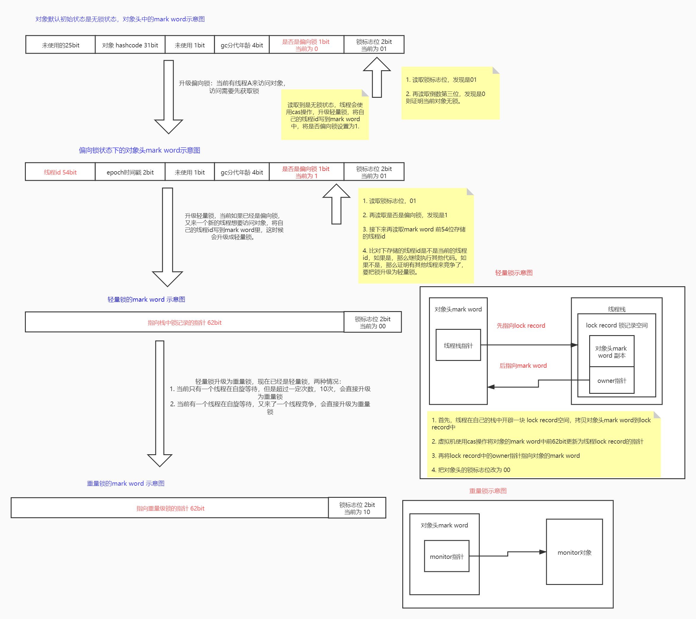

- java锁

  - 用来保证数据一致性，每个对象头都包含一把锁，记录了当前对象被哪个线程占用，对象头存储锁信息64位（32位虚拟机中是32位，64位虚拟机中是64位），叫做mark word，锁只能升级不能降级。
  
    <table>
    <tr>
    	<td>锁状态/gc</td>
        <td colspan="4">61bit</td>
        <td>是否偏向锁 1bit</td>
        <td>锁标志位 2bit</td>
    </tr>
    <tr>
        <td>无锁</td>
        <td>未使用 25bit</td>
        <td>对象的hashcode 31bit</td>
        <td>未使用 1bit</td>
        <td>分代年龄 4bit</td>
        <td>0</td>
        <td>01</td>
    </tr>
    <tr>
        <td>偏向锁</td>
        <td>线程id 54bit</td>
        <td>epoch时间戳 2bit</td>
        <td>未使用 1bit</td>
        <td>分代年龄 4bit</td>
        <td>1</td>
        <td>01</td>
    </tr>
    <tr>
        <td>轻量级锁</td>
        <td colspan="5">指向栈中锁记录的指针 62bit</td>
        <td>00</td>
    </tr>
    <tr>
        <td>重量级锁</td>
        <td colspan="5">指向重量级锁的指针 62bit</td>
        <td>10</td>
    </tr>
    <tr>
        <td>gc标记</td>
        <td colspan="5">空</td>
        <td>11</td>
    </tr>
    </table>
  
  - 四种锁状态
  
    - 无锁：不需要进行数据保护
    - 偏向锁：让对象认识线程，只将锁交给指定线程。
  
      - 首先读取对象头最后两位为 01，读取倒数第三位的值，为1，则是偏向锁
      - 再读取对象头的前54位，读取到线程id，如果线程id指向当前线程，那么线程获取锁，执行同步代码，如果线程id指向不是当前线程，则通过cas操作竞争锁，如果竞争成功，将mark word 中线程id设置成当前线程id，再执行同步代码。如果cas竞争失败，表示有其他线程竞争，此时其他线程会处于自旋状态，偏向锁升级为轻量锁。
      - 偏向锁在线程进入和退出同步代码时不再通过cas操作来加锁和解锁，而是检测mark word里是否存储着当前线程id。
    - 轻量锁：偏向锁升级而来，当前的线程在自旋等待
  
      - 线程首先在自己的虚拟机栈空间，开辟一块lock record空间，用来存放对象头中mark word副本和owner指针。
      - 拷贝对象头中mark word副本到lock record空间成功后，虚拟机将使用cas操作尝试将对象的mark word更新为指向lock record的指针，并将lock record里的owner指针指向对象的mark word。并且把对象的mark word的锁标志置为00，表示轻量锁。
      - 如果更新指针失败，虚拟机首先检查对象的mark word是否指向当前线程的lock record，如果是就说明当前线程已经有这个锁，可以继续执行同步代码。否则说明存在多个线程竞争。
      - 如果当前只有一个等待线程，则线程通过自旋进行等待。但是当自旋超过一定次数（10），或者一个线程持有锁，一个在自旋，又有第三个来竞争，锁会升级会重量级锁。
    - 重量锁：在编译后，会生成两个字节码指令
  
      - monitorenter
      - monitorexit
      - monitor是依赖于操作系统的mutex lock指令，java线程是对操作系统线程的一种映射，挂起或唤醒都会导致操作系统切换内核态，性能损耗比较大。
      - 锁的标志位变为10，此时mark word中存储的是指向重量级锁monitor的指针，等待的线程都将进入阻塞状态。
    - 锁状态升级示意图
    
  
  - 可重入锁和不可重入锁：
    - 可重入锁：reentrantlock和synchronized都是可重入锁，又名递归锁。指在同一个线程在外层方法获取锁的时候，再进入该线程的内层方法会自动获取锁（前提锁对象得是同一个对象或者class），不会因为之前已经获取过还没释放而阻塞，避免了死锁问题。
    - 不可重入锁：每次都会重新获取锁。
    
  - 自旋锁和适应性自旋锁：
    - 自旋锁：线程再获取锁失败时，会一直循环获取锁，直到获取锁为止。一直循环会导致cpu空转。
    - 适应性自旋锁：在自旋锁的基础上优化，假设之前这个锁在之前已经成功自旋获取过，那么这次自旋也很有可能可以获取到，虚拟机将允许自旋等待持续比较长的时间。如果对于某个锁，自旋基本都没成功获取过，那么就直接阻塞线程。
    
  - 公平锁和非公平锁：
    - 公平锁：在队列中，按照FIFO的顺序获取锁，先来先得。
    - 非公平锁：多个线程加锁时，直接尝试获取锁，获取不到才会入队等待。所以可能存在插队的情况，效率较高。
    
  - 独享锁和共享锁：
    - 独享锁：独享锁也叫排他锁，是指该锁一次只能被一个线程所持有。如果线程T对数据A加上排它锁后，则其他线程不能再对A加任何类型的锁。获得排它锁的线程即能读数据又能修改数据。JDK中的synchronized和JUC中Lock的实现类就是互斥锁。
    - 共享锁：共享锁是指该锁可被多个线程所持有。如果线程T对数据A加上共享锁后，则其他线程只能对A再加共享锁，不能加排它锁。获得共享锁的线程只能读数据，不能修改数据。独享锁与共享锁也是通过AQS来实现的。
  
- cas（compare and swap，比较并交换）：3个操作数，内存值V，旧的预期值A，要修改的新值B，只有在预期值A和内存值V相同时，才会将内存值V修改为B。这是一个cpu的原子操作。

- aqs（AbstractQueuedSynchronizer类）：使用FIFO双向链表管理线程。

  

​    

